# Broken brute-force protection, multiple credentials per request 
An authentication vulnerability is a security weakness that allows an attacker to bypass, weaken, or abuse the authentication process and gain access to an account or system without properly proving their identity. These can arise from poor password management, insecure session handling, weak multi-factor authentication implementations, credential stuffing attacks, brute-force attacks, or improper validation of authentication tokens and credentials. 
## Impact:
* Unauthorized access to user accounts by exploiting weak or compromised credentials.
* Account takeover through brute-force attacks, credential stuffing, password spraying, or session hijacking.
* Privilege escalation when attackers gain access to administrative or high-privilege accounts.
* Exposure of sensitive information, including personal data, financial records, and confidential business information.
* Unauthorized actions performed on behalf of legitimate users, potentially leading to financial loss, data breaches, or reputational damage.
* Compromise of multiple systems when authentication mechanisms are shared across applications (Single Sign-On environments).
## Mitigation:
* Enforce strong password policies, including minimum length, complexity requirements, and password expiration where appropriate.
* Implement Multi-Factor Authentication (MFA) for all sensitive accounts and administrative access.
* Protect against brute-force attacks using account lockout mechanisms, rate limiting, CAPTCHA, and monitoring for suspicious login attempts.
* Store passwords securely using strong hashing algorithms such as bcrypt, Argon2, or PBKDF2 with unique salts.
* Use secure session management practices, including secure cookies, session expiration, and session invalidation after logout.
* Implement proper authentication token validation and ensure tokens are securely generated, transmitted, and stored.
## Lab: Broken brute-force protection, multiple credentials per request
* Open the URL in portswigger proxy tab to intercept the request.
  
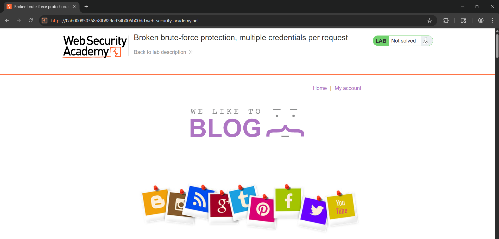
* Go to my account and login using username=carlos(given), and a random password to intercept the POST request on burp.

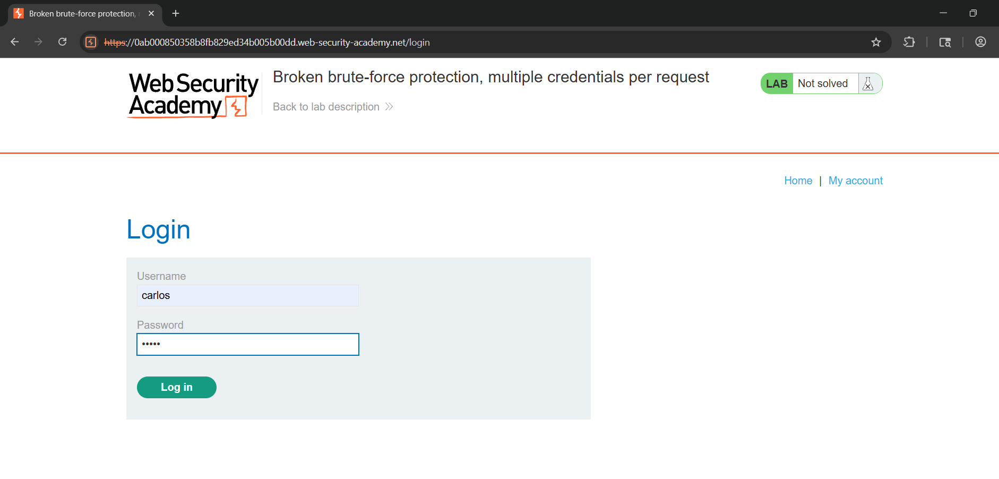
* Send the request to repeater to exploit the brute force protection, by using multiple credentials in a single request.

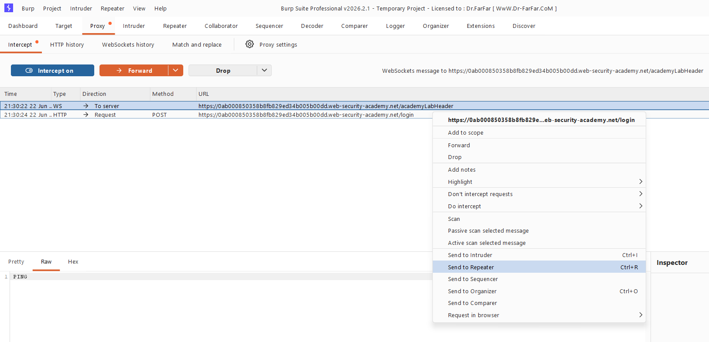
* In the repeater, change the password to a given set list of passwords into JSON format and repeat the request.

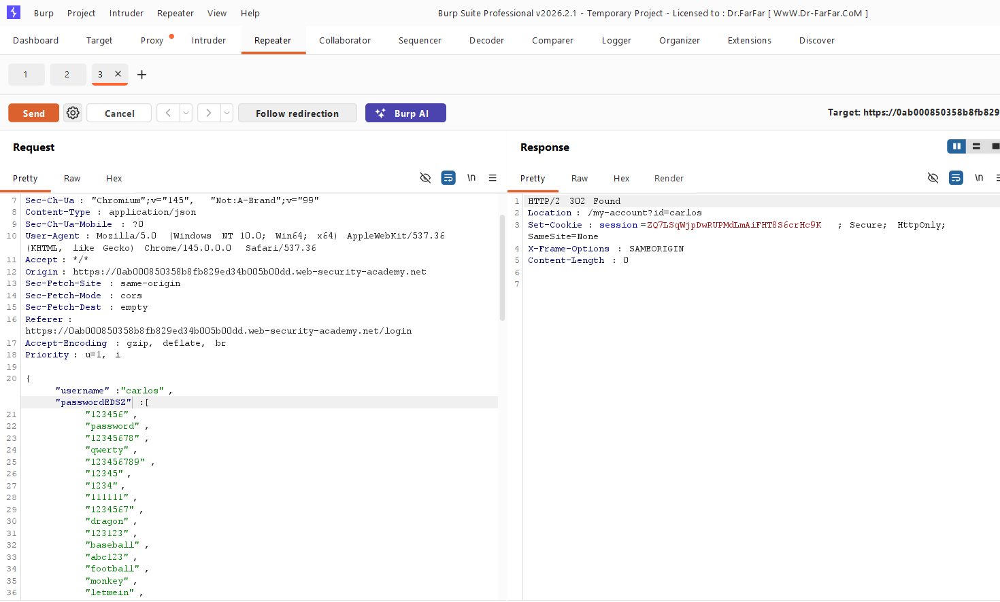  
* Open the request in browser

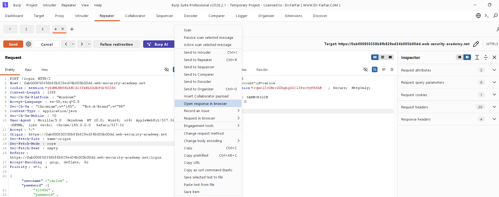
* We have access to Carlos’s account

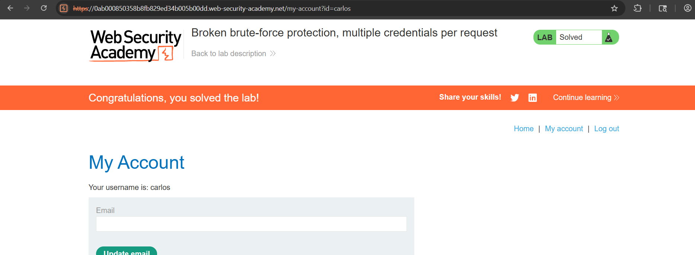

## Lab: 2FA bypass using a brute-force attack

* Open the lab in the burpsuite proxy browser and go to my account to log in to carlos’s account using the given credentials: carlos:montoya.

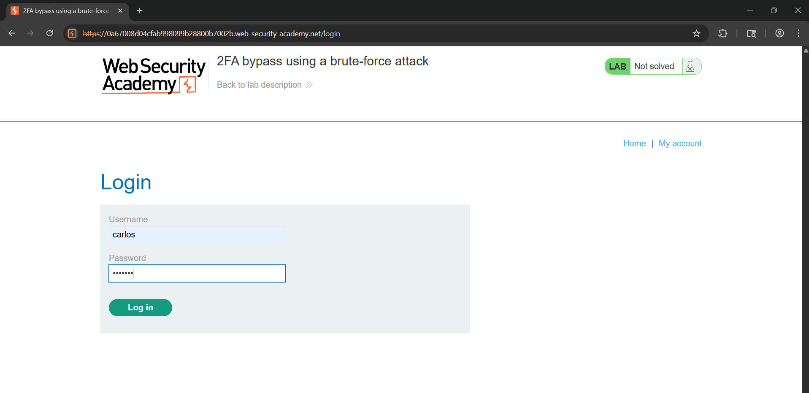
* It asks for a verification code, add a random four digit number for the verification code to capture the request in burp.

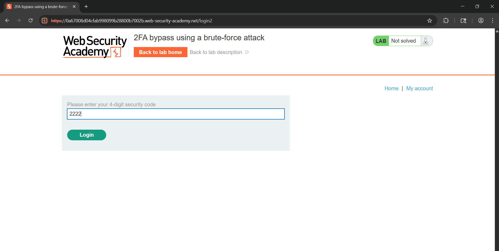
* After failing the verification once, we get another chance to add another verification code, failing that, it logs us out of carlos’s account.

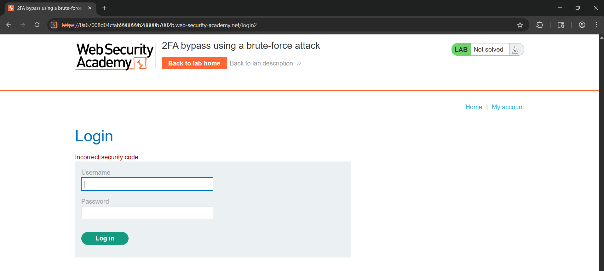
* We need to use burp’s session handling features to log back in automatically after sending each request.

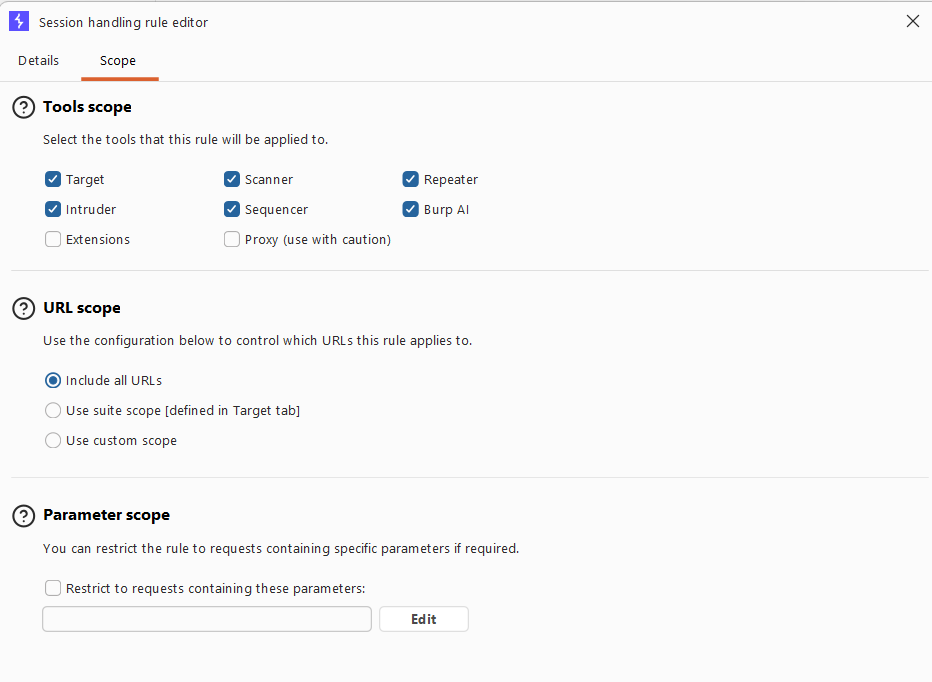
* We add a rule to run a macro every time we brute force

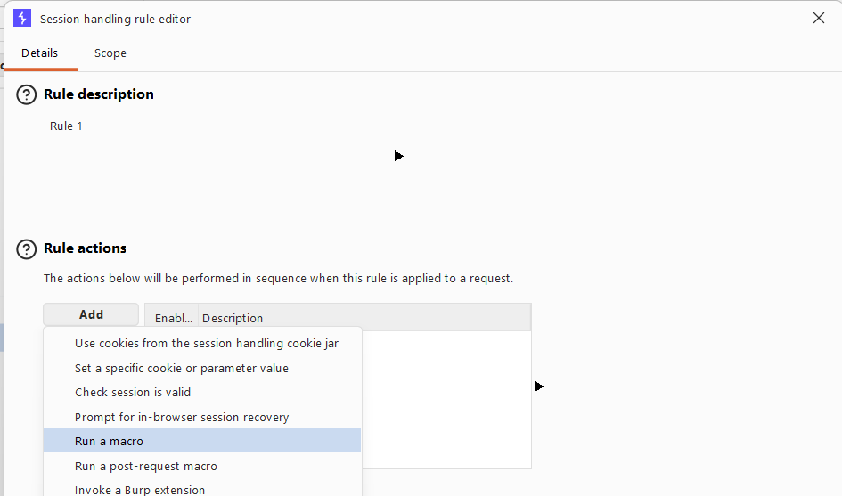
* Add the requests that are to be run in sequential order.

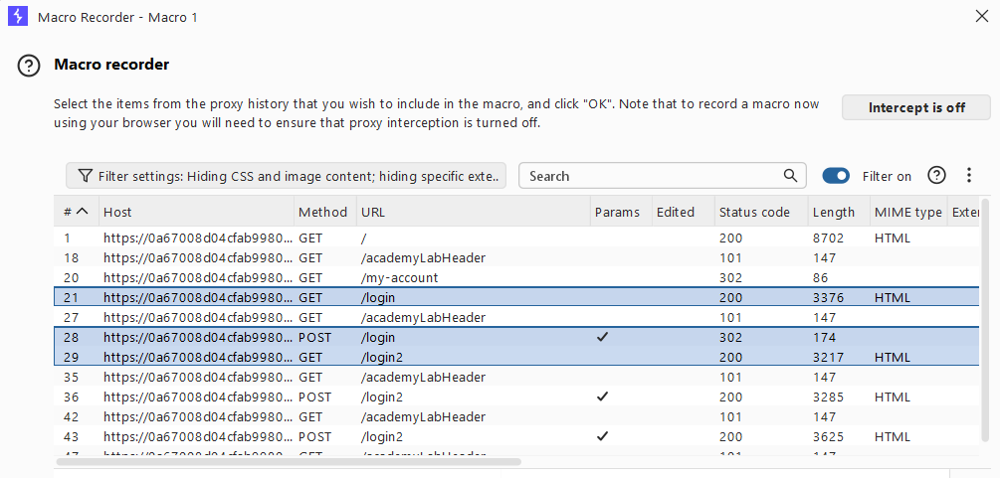
* To successfully find the authentication code, we need to brute force the code in the verification page using burp’s intruder. Send the POST request to burp’s intruder.

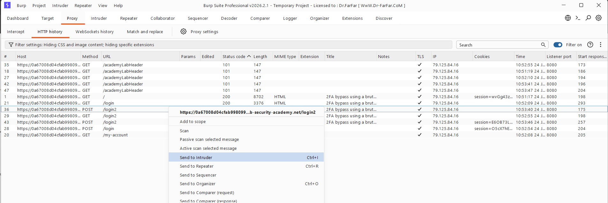
* Add payload and payload rules to be only integers to the mfa-code position, and set it to only 4-digit integers since only integers are allowed and the code is of 4 digits.

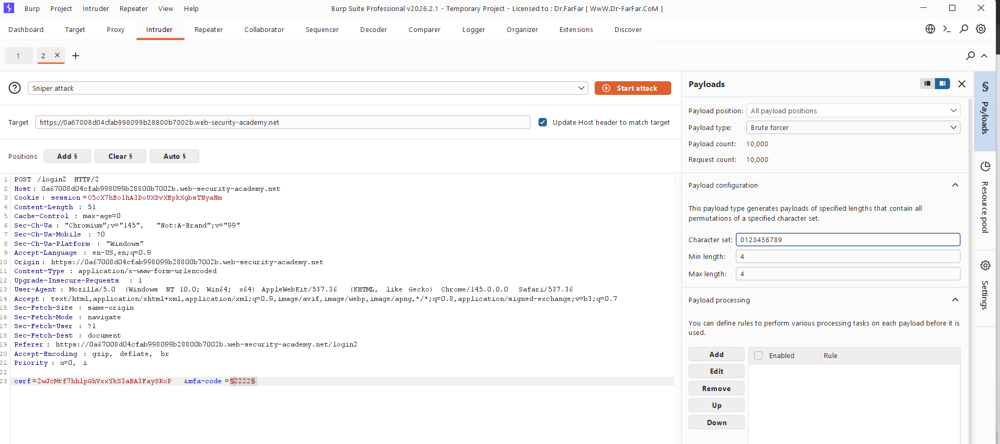
* Set maximum concurrent requests to be 1 in the resource pool, otherwise we will be logged out of the account in case of 2 requests.

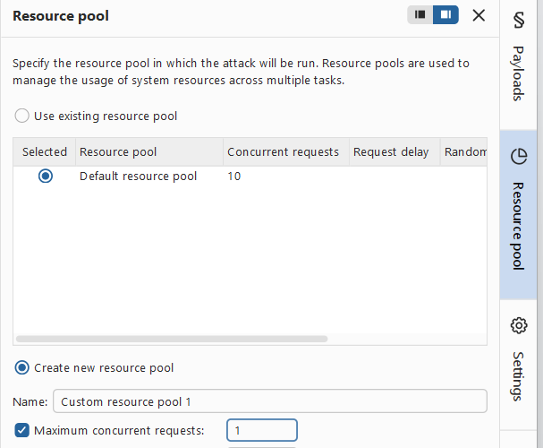
* Start the attack, and wait till we get a status code of 302(found). On opening the response, we find the session id that can be used to replace session permanently.

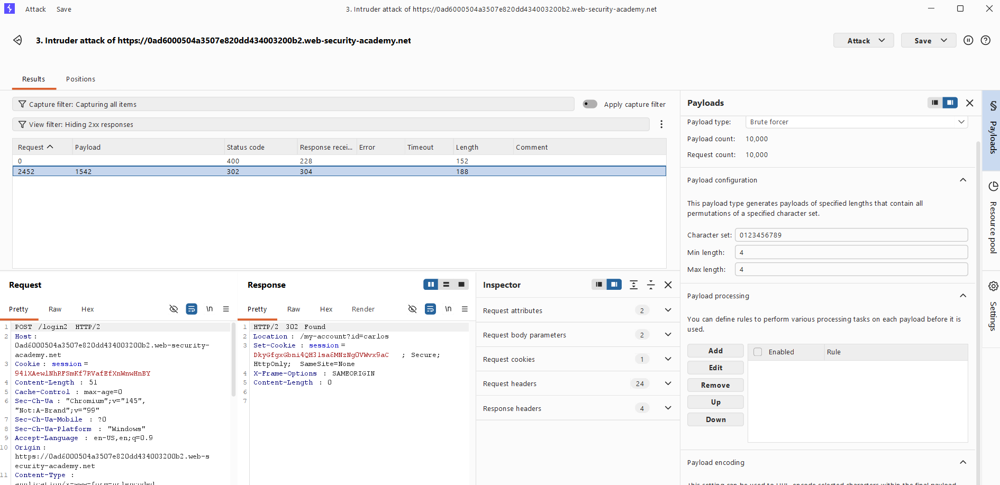
* We go to the inspect page of the website where the cookie’s session id is stored, and replace that with the id that had been found

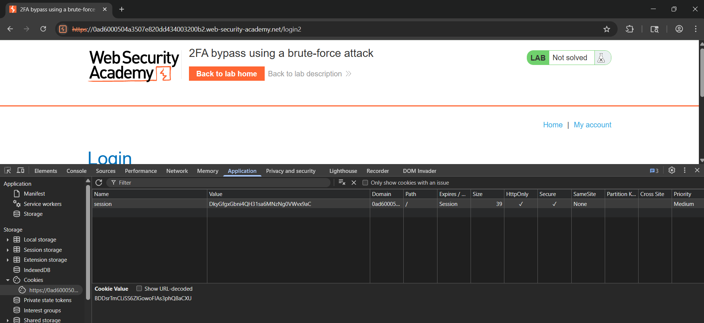
* After replacing the session id, we have solved the lab, and are now logged in into Carlos’s account

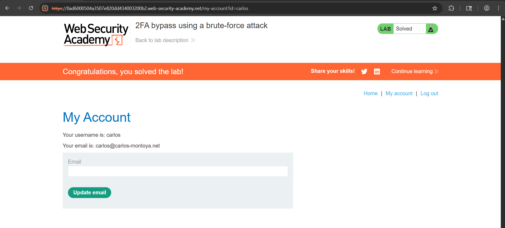
