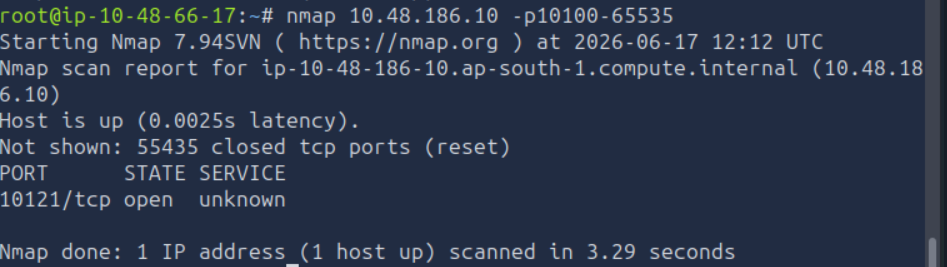
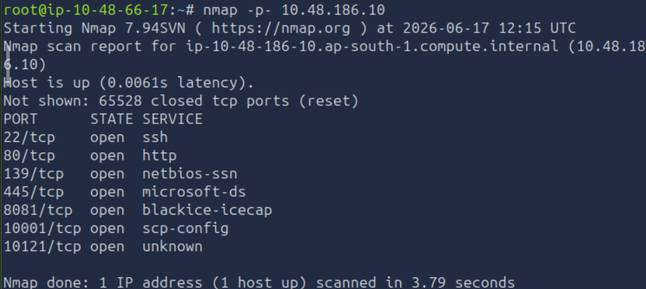

# Net Sec Challenge
### Walkthrough for the net sec challenge room in TryHackMe
## Prerequisites:
* nmap
* telnet
* hydra

## Challenge Process:
### Q1. What is the highest port number that is open and less than 10,000?
* To find the open ports, and the highest port number that is less than 10000, need to find the ports between 1 and 10000. Hence we use the command `nmap <machine_ip> -p1-10000`

Hence, we find that the highest open port is port 8081
### Q2. There is an open port outside the common 1000 ports; it is above 10,100. What is it?
* To find an open port above 10,000, we use the command `nmap <machine_ip> -p10100-65535`, since the total ports are 1 to 65535.

This tells us that the only open port above 10100 is 10121
### Q3. How many TCP ports are open?
* To find all open ports in the target system, we use the -p- flag. The command we used here is `nmap -p- <machine_ip>`

The total number of ports open that are visible here is 7.

### Q4. On port 80, what is the service version value?

