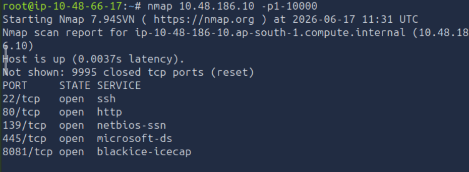

# Net Sec Challenge
### Walkthrough for the net sec challenge room in TryHackMe
## Prerequisites:
* nmap
* telnet
* hydra

## Challenge Process:
### Q1. What is the highest port number that is open and less than 10,000?
* To find the open ports, and the hightest port number that is less than 10000, need to find the ports between 1 and 10000. Hence we use the command `nmap <machine_ip> -p1-10000`

Hence, we find that the highest open port is port 8081
### Q2. 
